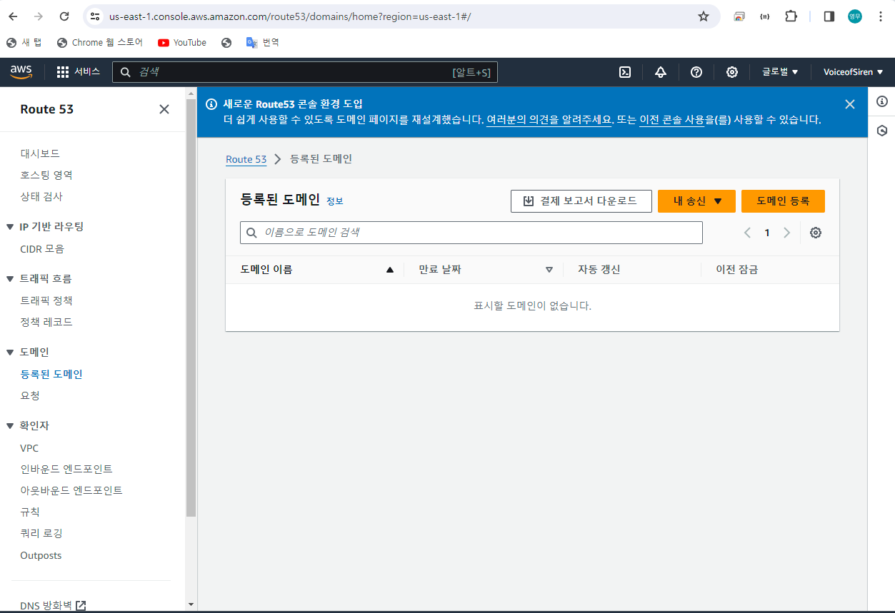
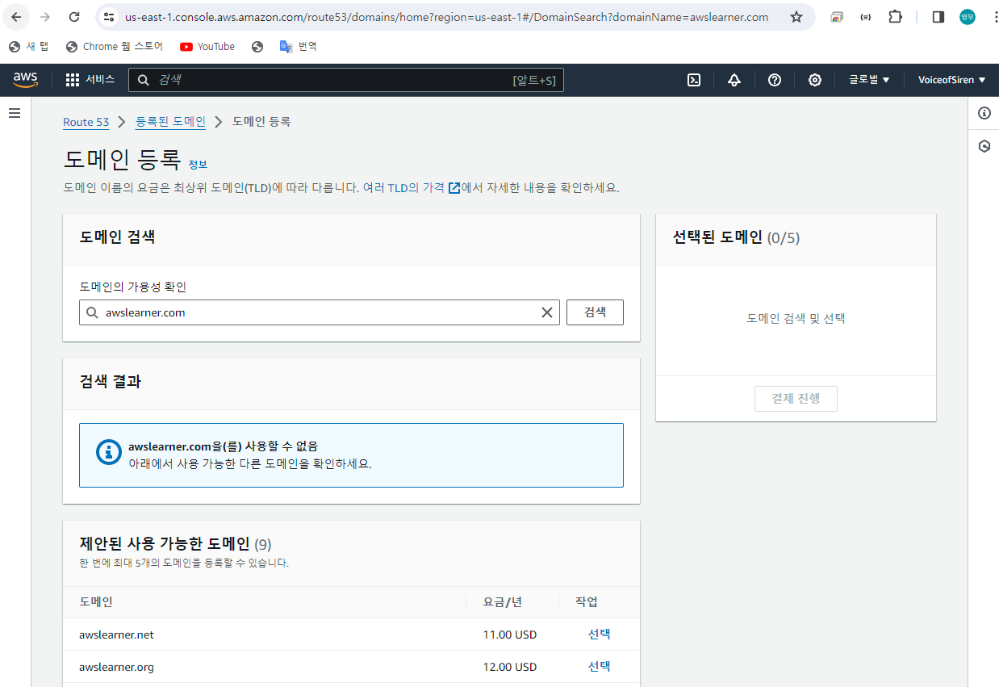

# EC2
 

### 이 글의 목적
    - EC2의 Route 53에 대해 알아보고자 한다.
 

### 1. Route 53
    - Domain을 등록하거나 DNS를 구성하는 DNS 서비스이다.
- 서비스 종류
    - EC2 Instance
    - S3 Bucket
    - Load Balancer
 

### 2. 실습
#### 1) 도메인 등록
- https://us-east-1.console.aws.amazon.com/route53/v2/home?region=us-east-1#Dashboard 접속
- 좌측 내비게이션의 '도메인' 탭 클릭 후 도메인 등록 버튼 클릭

- awslearner.com 검색 시 사용할 수 없다는 메시지를 확인

- awslearner-dmitry-vos.com 검색 시 사용할 수 있다고 뜨면 장바구니에 담기

