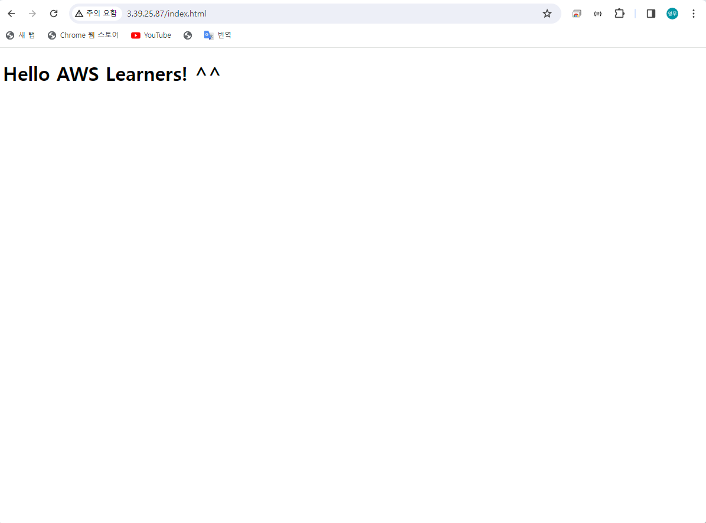

# EC2
<br/>

### 이 글의 목적
    - putty를 이용하여 EC2를 실습해 보고자 한다.
<br/>

### 1. Putty 설치
1. https://www.chiark.greenend.org.uk/~sgtatham/putty/ 접속
2. 상단의 Download it here. 링크 클릭
3. putty.exe와 puttygen.exe를 다운로드 (64-bit x86)
  - putty: SSH를 사용하여 원격 접속을 가능하게 해주는 응용 프로그램.
  - puttygen: EC2 instance를 만들 때 우리에게 주어지는 pem 파일을 ppk 파일로 변환해주는 응용 프로그램. (putty는 ppk 파일만 인식 가능.)
<br/>

### 2. EC2 인스턴스 생성
1. https://us-east-1.console.aws.amazon.com/ec2/home?region=us-east-1#Home: 접속
  - 현재 실행 중인 instance가 없다는 것을 확인할 수 있다.
2. 우측 상단의 지역 설정을 '아시아 태평양 (서울)'으로 지정한다.
3. 좌측 내비게이션의 '인스턴스' 메뉴 하위의 '인스턴스' 링크를 클릭한다.
4. '인스턴스 시작' 버튼 클릭한다.
5. AMI (Amazon Machine Image): 'Amazon Linux 2 AMI (HVM) - Kernel 5.10, SSD Volume Type'을 선택
6. Instance 유형: Free Tier 사용 가능한 't2.micro'를 선택한다.
7. 키 페어를 새로 생성한다. (awslearner_window.pem 파일 다운로드)
8. 나머지 항목은 모두 건너뛰고 '인스턴스 시작' 버튼을 클릭한다.
<br/>

### 3. puttygen 실행
1. puttygen 응용 프로그램을 실행한다.
2. 'Load' 버튼 클릭 후 이전에 다운로드 받은 awslearner_window.pem 파일을 선택한다.
3. Key passphrase와 Confirm passphrase를 동일하게 입력한 후 'Save private key' 버튼을 클릭한다.
4. ppk 확장자명으로 파일을 저장한다.
<br/>

### 4. putty 실행 및 EC2 인스턴스 접속
1. putty 응용 프로그램을 실행한다.
2. 실행 중인 인스턴스의 Public IPv4 Address를 putty의 'Host Name (or IP address)' 란에 입력한다.
3. 입력한 IP 주소 앞에 'ec2-user@'를 추가로 입력한다.
4. 좌측 Category 메뉴의 Connection -> SSH -> Auth -> Credentials를 순서대로 선택한다.
5. 'Private key file or authentication' 에서 puttygen으로 저장한 'awslearner_window.ppk' 파일을 선택한다.
6. 좌측 Category 메뉴의 Session을 선택한 후 'Saved Sessions' 쪽에 'aws_learner_window_session'을 입력한 후 'Save' 버튼을 클릭한다.
7. 우측 하단에 있는 'Open' 버튼을 클릭한다.
8. 경고가 뜨면 'Accept' 버튼을 클릭한다.
9. Passphrase를 입력하면 EC2 인스턴스에 접속할 수 있다.
<br/>

### 5. EC2 실습
1. 현재 접속한 계정을 Root 유저로 지정
```script
sudo su
```
2. OS를 업데이트하고 모든 관련 패키지를 설치
```script
yum update -y
```
3. apache 설치
```script
yum install httpd -y
```
4. apache 실행
```script
service httpd start
```
5. EC2 인스턴스 재부팅 시 Apache 서버도 자동으로 켜지는 설정
```script
chkconfig httpd on
```
6. 디렉터리 이동
```script
cd /var/www/html
```
7. index.html 파일 생성
```script
vi index.html
```
```html
<html>
<body>
<h1>Hello AWS Learners! ^^</h1>
</body>
</html>
```
8. EC2 인스턴스의 Public IP 주소인 3.39.25.87에 접속
9. 해당 html 파일이 뜨지 않아 구글링...
<br/>

### 6. 문제 해결
1. 해당 인스턴스의 보안 그룹을 추가하여 인바운드 규칙에 HTTP, HTTPS 및 SSH 접속이 가능하도록 설정하였다.
2. 다시 3.39.25.87에 접속

