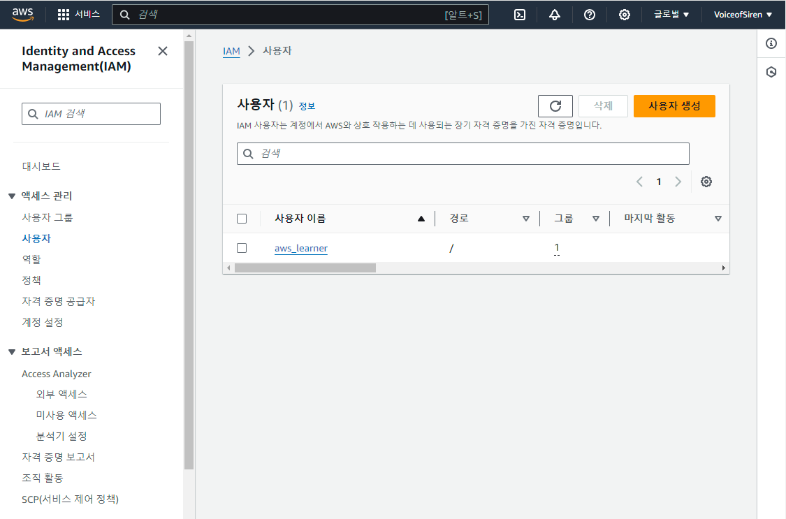
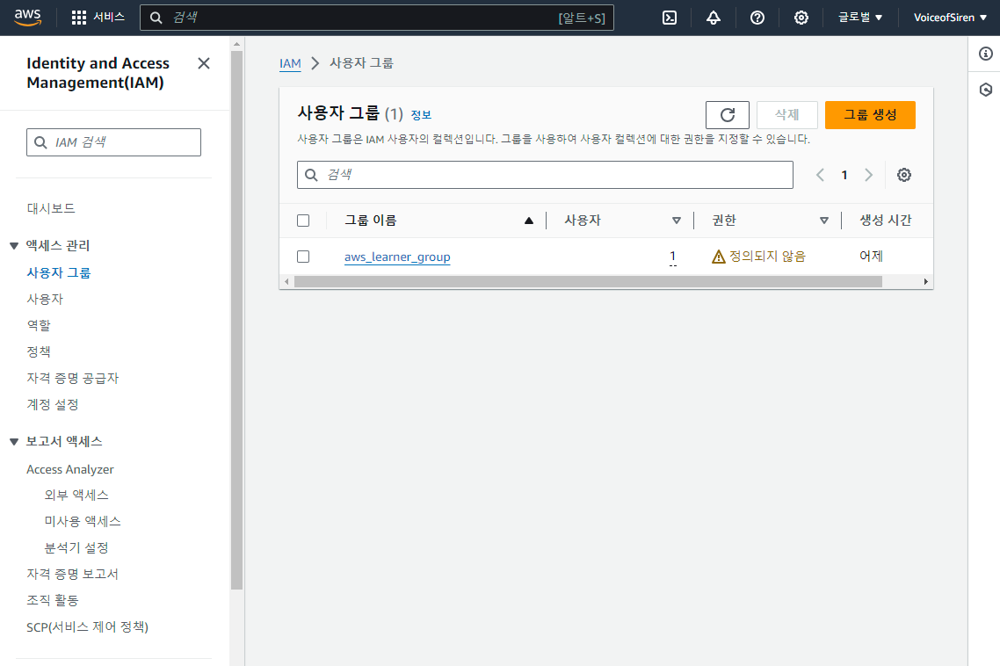
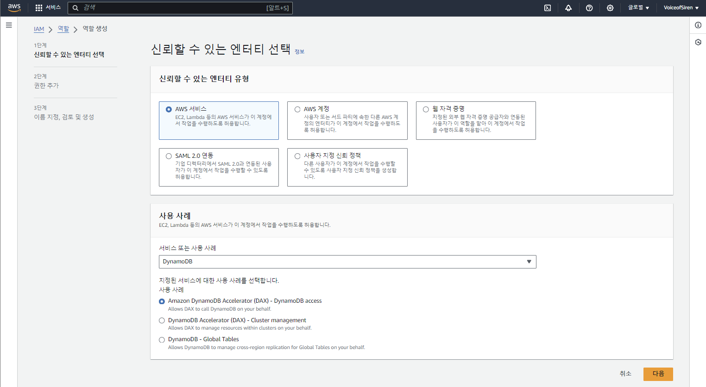
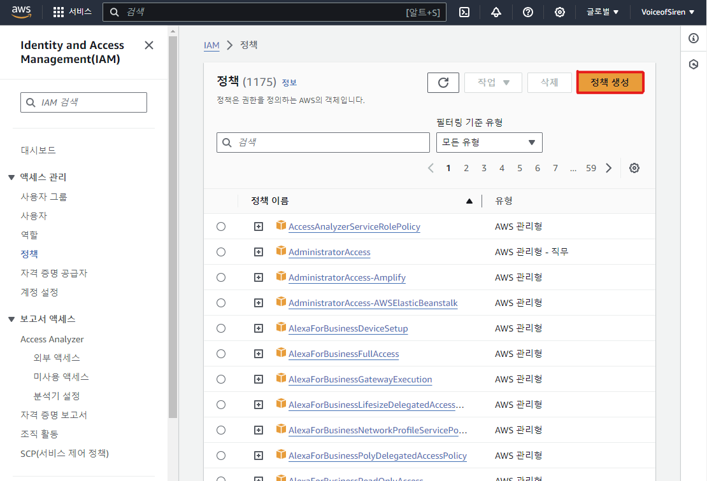
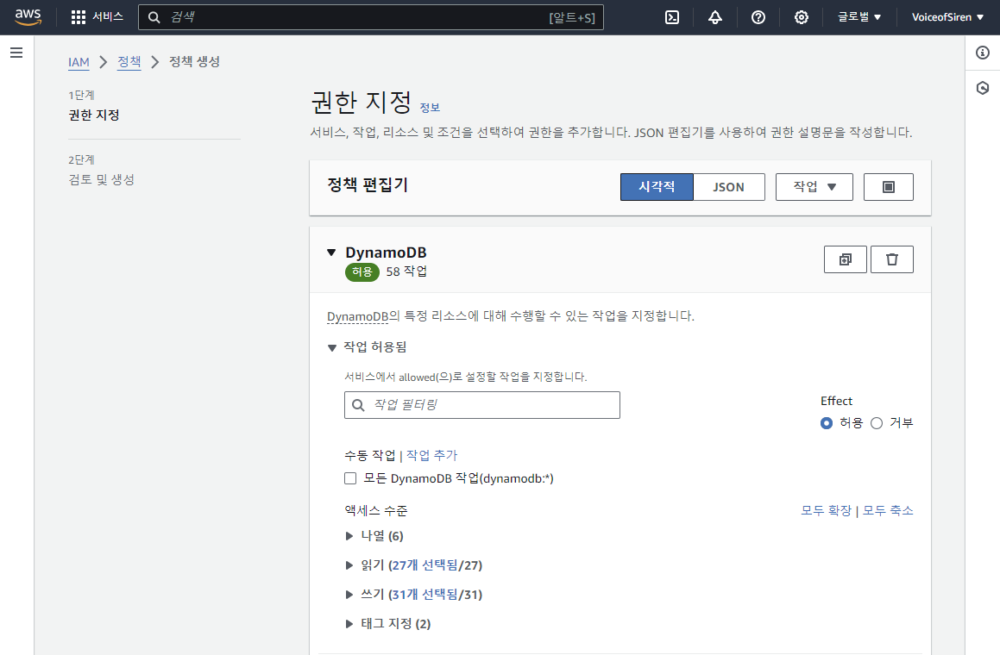
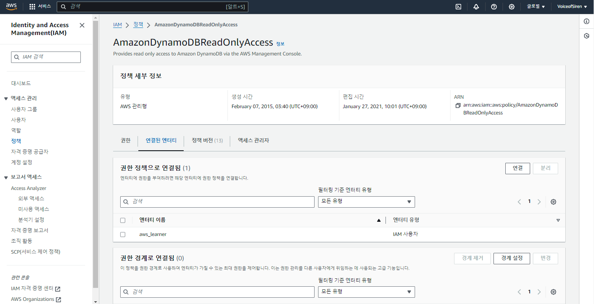

# IAM
 

### 이 글의 목적
    - IAM 정책 시뮬레이터를 사용하여 실습을 진행해보고자 한다.
 

### 1. IAM 정책 시뮬레이터
- IAM과 관련된 문제들을 디버깅하기에 최적화된 툴이다.
- 개발 환경에서 실제 환경으로 build하기 전 IAM 정책이 잘 작동되는지 테스트하기 위해 사용한다.
#### 1) IAM - 사용자
- [그림 1]과 같이 사용자를 만들 수 있다.
#### [그림 1]

 

#### 2) IAM - 그룹
- [그림 2]와 같이 그룹을 만들 수 있다.
#### [그림 2]

 

#### 3) IAM - 역할
- [그림 3]과 같이 역할을 만들 수 있다.
#### [그림 3]

 

#### 4) IAM - 정책
- [그림 4-1]-[그림 4-3]과 같이 정책을 만들 수 있다.
#### [그림 4-1] - 정책 생성

#### [그림 4-2] - 권한 지정

#### [그림 4-3] - 연결된 Entity 조회

