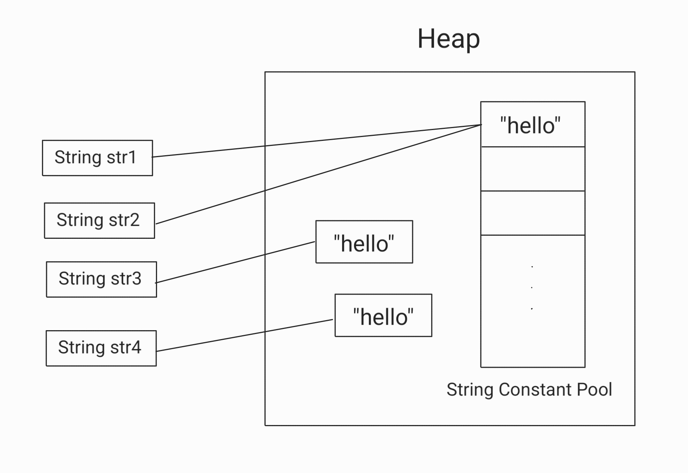

# String

### String
    - C언어에서는 char 배열을 이용하여 문자열을 다루지만, JAVA에서는 String 클래스를 통해 쉽게 문자열을 처리할 수 있다.
    - 일반적인 참조타입과 동일하게 Stack 영역에 변수명과 함께 문자열 객체의 번지수가 저장되고
      해당 번지수를 통해 Heap 영역 내에 실제 존재하는 객체 데이터를 이용할 수 있다.

#### JAVA의 String과 관련하여 가지고 있는 기초 지식은 다음과 같다.
#### [코드 1]
```java
    String str1 = "abc";
    boolean ifEquals = str1.equals("abc");
    System.out.println(ifEquals);
```
#### [결과 1]
    true
#### --> [코드 1]에서처럼, 변수 str1에 담긴 문자열과 문자열 "abc"가 같은지 확인하는 조건문에는 등호 (==)가 아닌 .equals() 메서드를 사용해야 한다. <br/> 그 이유는, 등호의 경우 단순히 두 객체의 주소값이 같은지를 비교하는 반면, <br/> .equals()메서드는 매개변수로 객체의 참조변수를 받아서 값을 비교하여 그 결과를 boolean 값으로 알려 주는 역할을 하기 때문이다.
<br/>

#### 한편, JAVA 입문자 수준에서는 이해하기 어려운 개념이 있는데, 바로 [코드 2]와 [결과 2]를 보도록 하자. 
#### [코드 2]
```java
    String str1 = "abc";
    boolean ifEquals = (str1=="abc");
    System.out.println(ifEquals);
```
#### [결과 2]
    true
#### 분명히 문자열끼리 비교할 때는 .equals()를 사용한다고 배웠으나, 등호를 사용할 때도 같은 결과가 나옴을 [결과 2]에서 확인할 수 있다. 
#### 이를 이해하기 위해서는 String 문자열의 두 가지 생성 방식에 대해 구분하여 알고 있어야 한다.
#### 필자는 String 문자열의 두 가지 생성 방식인 new와 리터럴에 대하여 설명하고자 한다.

<br><br>

### 1. 리터럴 생성 방식
#### [코드 3-1]
```java
    String str1 = "hello";
    String str2 = "hello";
```
#### --> [코드 3-1]은 String 참조 변수에 리터럴 상수를 할당하는 방식으로, str1과 str2를 Heap 영역에 있는 String Constant Pool에 할당시키는 방법이다.
#### String Constant Pool에 대한 설명은 아래의 [그림 1]을 참고하자.
<br/>

### 2. new 연산자 생성 방식
#### [코드 3-2]
```java
    String str3 = new String("hello");
    String str4 = new String("hello");
```
#### --> [코드 3-2]는 여타 다른 객체를 생성하는 방법과 동일하게 str3를 Heap 영역에 할당시키는 방법이다.

<br/>

#### [그림 1] String Constant Pool


#### - 리터럴 상수를 사용하여 동일한 문자열을 생성할 경우, 해당 객체들 (str1, str2)은 String Constant Pool 내의 동일한 객체를 참조한다.
#### - new 연산자를 사용하여 동일한 문자열을 생성할 경우, 해당 객체들 (str3, str4)은 Heap 영역의 각자 다른 객체를 참조한다.


