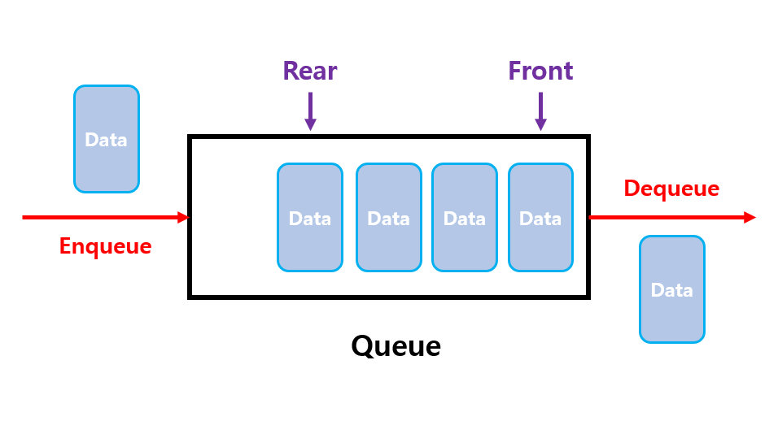

# Queue
###### (more info: https://www.geeksforgeeks.org/queue-interface-java/ )
<br/>

### 이 글의 목적
    - Queue Interface에 대해 알아보고자 한다.
<br/>

### 1. Queue
- Queue 자료 구조에는 아래의 용어가 쓰인다.
#### [용어]
```plaintext
- front: 제일 앞에 있는 요소를 가리키는 용어
- rear: 제일 뒤에 있는 요소를 가리키는 용어
- enqueue: queue에 데이터를 저장하는 행위
- dequeue: queue에서 데이터를 인출하는 행위
```
#### [그림 1]

- Queue 자료 구조는 아래의 특징을 가진다.
#### [특징]
```plaintext
1. 선입선출 (FIFO): front에 있는 요소가 제일 먼저 인출되거나 조회된다.
2. 데이터를 일시적으로 쌓아두고 처리해야 하는 경우에 자주 사용된다.
```

### 2. Queue Interface
- 선입선출의 특성을 가지는 자료 구조를 제공하는 인터페이스
- Collection 인터페이스를 상속받는 인터페이스
<br/>

### 3. Queue의 메서드
- Queue 인터페이스는 아래의 메서드를 제공한다.
#### [Method] - 요소 추가
```plaintext
1. add(E e): queue의 맨 뒤에 요소를 추가한다.
             queue가 가득 차 있으면 IllegalStateException이 발생한다.
2. offer(E e): queue의 맨 뒤에 요소를 추가한다.
               queue가 가득 차 있으면 false를 반환한다.
```
#### [Method] - 요소 제거
```plaintext
1. remove(): queue의 맨 앞에 있는 요소를 반환하고 제거한다.
             queue가 비어 있으면 NoSuchElementException이 발생한다.
2. poll(): queue의 맨 앞에 있는 요소를 제거하고 반환한다.
           queue가 비어 있으면 null을 반환한다.
3. clear(): queue를 비운다.
```
#### [Method] - 요소 조회
```plaintext
1. element(): queue의 맨 앞에 있는 요소를 반환한다.
              queue가 비어 있으면 NoSuchElementException이 발생한다.
2. peek(): queue의 앞에서 요소를 반환한다.
           queue가 비어 있으면 null을 반환한다.
```
<br/>

### 4. Queue 인터페이스를 구현하는 클래스
#### [Class]
```plaintext
1. LinkedList
2. PriorityQueue
3. ConcurrentLinkedQueue
4. ArrayBlockingQueue
5. LinkedBlockingQueue
```
#### 향후 LinkedList와 PriorityQueue에 대해 알아볼 것이다.

