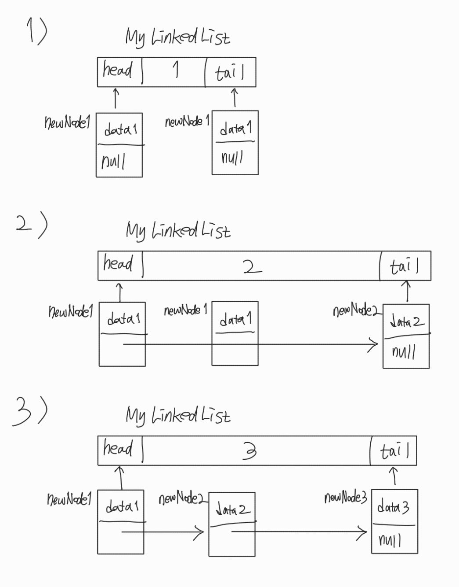
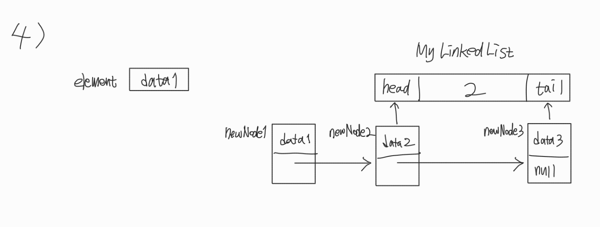

# Queue
###### (more info: https://www.geeksforgeeks.org/queue-interface-java/ )

### 이 글의 목적
    - LinkedList Class에 대해 알아보고자 한다.
<br/>

### 1. LinkedList Class
- Queue 인터페이스의 구현 클래스이다.
#### - 사용 목적
- Queue Interface의 구현 클래스가 ArrayList가 아니라 LinkedList인 이유에 대하여 알아보고자 한다.
#### 1) ArrayList
```plaintext
- ArrayList의 데이터들은 메모리 (RAM) 상에서 연속된 공간에 저장된다.
- 요소를 get하는 과정에서 무작위 접근 (Random Access) 및 순차적 접근 (Sequential Access) 모두 가능하다.
- 중간에 데이터를 저장해야 하거나 용량이 가득찬 경우, 기존의 배열을 복사해서 요소를 일일이 shift시켜야 하는 작업이 필요하다.
```
#### 2) LinkedList
```plaintext
- LinkedList의 데이터들은 메모리 상에서 불연속된 공간에 저장되며, 각각 데이터들을 링크시키기 위한 참조 변수가 추가로 할당된다.
- 요소를 get하는 과정에서 순차적 접근만 가능하다.
- 맨 앞의 요소를 제거하는 것과 맨 뒤에 요소를 추가하는 것 자체의 시간 복잡도는 O(1)이지만, 중간에 있는 요소를 추가하거나 삭제하기 위해서는 길이가 N인 배열을 전부 탐색해야 하므로 시간 복잡도는 O(N)이 된다.
```
<br/>

### 2. LinkedList Class 생성
- [코드 1]은 LinkedList 클래스를 사용한 예시이다.
- Queue 자료 구조에서의 peek()은 rear가 아닌 front를 참조한다는 점에 유의해야 한다.
#### - [결과 1]은 [코드 1]에 대한 결과이다.
#### [코드 1]
```java
import java.util.LinkedList;
import java.util.Queue;

public class Main {
    public static void main(String[] args) {

        Queue<Object> queue = new LinkedList<>();
        System.out.println(queue.add(10));      //      10
        queue.add(20);                          //      10-20
        queue.add(30);                          //      10-20-30
        System.out.println(queue.peek());       //  10; 10-20-30
        queue.remove();                         //  10 제거
        System.out.println(queue.peek());       //  20; 20-30
        System.out.println(queue.poll());       //  20 제거
        System.out.println(queue.peek());       //  30; 30
        System.out.println(queue.offer(40));    //true; 30-40
        System.out.println(queue.peek());       //  30; 30-40
        System.out.println(queue.offer(50));    //true; 30-40-50
        System.out.println(queue.peek());       //  30; 30-40-50
        System.out.println(queue.poll());       //  30; 40-50
        System.out.println(queue.poll());       //  40; 50
        queue.offer(queue.poll());              //      50
        System.out.println(queue.poll());       //  50;
        System.out.println(queue.poll());       // null

    }
}
```
#### [결과 1]
```plaintext
true
10
20
20
30
true
30
true
30
30
40
50
null
```
<br/>

### 3. MyLinkedList Class 구현
- Queue 인터페이스를 구현하는 MyLinkedList 클래스를 정의하였으며, MyLinkedList 객체에 저장되어 있는 각각의 요소들을 Node 클래스로 정의하였다.
- 대표적인 메서드인 add(), poll(), peek() 등을 구현하였다.
#### [코드 2-1]
```java
package data_structure.queue.linked_list;

public class Node<E> {
    E data;
    Node<E> next;

    public Node(E data) {
        this.data = data;
        this.next = null;
    }
}
```
#### [코드 2-2]
```java
package data_structure.queue.linked_list;

import java.util.*;

public class MyLinkedList<E> implements Queue<E> {

    private Node<E> head;
    private Node<E> tail;
    private int size;

    public MyLinkedList() {
        this.head = null;
        this.tail = null;
        this.size = 0;
    }

    @Override
    public boolean add(E element) {
        Node<E> newNode = new Node<>(element);

        if (isEmpty()) {
            head = tail = newNode;
        } else {
            tail.next = newNode;
            tail = newNode;
        }

        size++;
        return true;
    }

    @Override
    public E poll() {
        if (isEmpty()) {
            return null;
        }

        E element = head.data;
        head = head.next;

        if (head == null) {
            tail = null;
        }

        size--;
        return element;
    }

    @Override
    public String toString() {
        StringBuilder sb = new StringBuilder("[");

        Node<E> current = head;
        while (current != null) {
            sb.append(current.data).append(", ");
            current = current.next;
        }

        sb.append("]");
        return sb.toString();
    }

    @Override
    public E peek() {
        if (isEmpty()) {
            return null;
        }

        return head.data;
    }

    @Override
    public int size() {
        return size;
    }

    /*
    @Override
    public boolean isEmpty() {
        return head == null;
    }

    @Override
    public boolean remove(Object o) {
        return false;
    }

    @Override
    public boolean containsAll(Collection<?> c) {
        return false;
    }

    @Override
    public boolean addAll(Collection<? extends E> c) {
        return false;
    }

    @Override
    public boolean removeAll(Collection<?> c) {
        return false;
    }

    @Override
    public boolean retainAll(Collection<?> c) {
        return false;
    }

    @Override
    public void clear() {

    }

    @Override
    public boolean offer(E e) {
        return false;
    }

    @Override
    public E remove() {
        return null;
    }

    @Override
    public E element() {
        return null;
    }

    @Override
    public boolean contains(Object o) {
        return false;
    }

    @Override
    public Iterator<E> iterator() {
        return null;
    }

    @Override
    public Object[] toArray() {
        return new Object[0];
    }

    @Override
    public <T> T[] toArray(T[] a) {
        return null;
    }
    */
}
```
#### [코드 2-3]
```java
import data_structure.queue.linked_list.MyLinkedList;
import java.util.Queue;

public class Main {
    public static void main(String[] args) {

        Queue<Object> myQueue = new MyLinkedList<Object>();

        System.out.println(myQueue.isEmpty());      // true
        myQueue.add("A");                           //          / A
        myQueue.add("B");                           //          / A - B
        System.out.println(myQueue.peek());         // A        / A - B
        System.out.println(myQueue.poll());         // A        / B
        myQueue.add("C");                           //          / B - C
        System.out.println(myQueue.toString());     // [B, C, ] / B - C

    }
}
```
#### [결과 2]
```plaintext
true
A
A
[B, C, ]
```
- MyLinkedList 객체에 요소들이 추가되는 과정을 [그림 1]로 그려보았다. (add() 호출)
#### [그림 1]

- MyLinkedList 객체에 요소가 삭제되는 과정을 [그림 2]로 그려보았다. (poll() 호출)
#### [그림 2]

