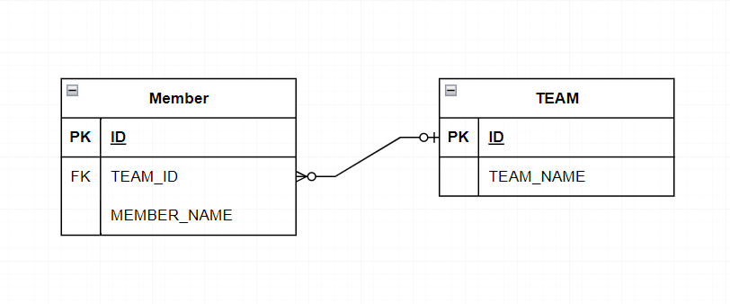
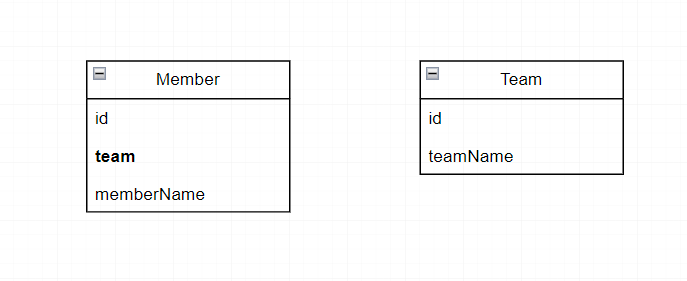

# Relationship
<br/>

### 이 글의 목적
```plaintext
- JPA의 Relationship Mapping (연관관계 매핑)에 대해 알아보고자 한다.
```
<br/>

### 1. 연관관계 매핑
- DBMS와 JAVA에서 데이터를 묶는 방식의 차이점에 대해 알아보자.
#### 1) DBMS
```plaintext
1. 테이블 정규화 과정을 거쳐 한 쪽의 테이블에 외래키를 만든다.
2. 외래키 제약에 걸린 테이블들 중 한 쪽에 있는 외래키만을 통해 JOIN 연산자로 데이터를 가져올 수 있다.
```
#### 2) JAVA
```plaintext
1. 어떤 객체가 다른 객체를 참조하는 방식으로 구현한다.
2. 한 쪽에 다른 객체를 참조하는 필드가 있더라도, 역으로 참조할 수는 없다.
```
#### --> 이와 같은 차이점을 해결해주는 JPA의 매핑에 대해 알아보자.
<br/>

### 2. 단방향 연관관계 (Unidirectional Relationship)
- TEAM 테이블과 MEMBER 테이블이 있고 TEAM 테이블을 가리키는 외래키 TEAM_ID가 MEMBER 테이블에 있다고 가정할 때의 간단한 연관관계 예시를 [그림 1-1]과 [그림 1-2]로 그려보았다.
#### [그림 1-1] - 테이블 연관관계

#### [그림 1-2] - 객체 연관관계

#### 1) 테이블 연관관계
- MEMBER 테이블에 있는 외래키 TEAM_ID를 통해 JOIN 연산자로 데이터를 가져올 수 있다.
- 해당 JOIN 연산자를 사용한 SQL문은 [코드 1]과 같다.
#### [코드 1]
```sql
SELECT *
    FROM Member m
    LEFT JOIN Team t ON m.teamId = t.id;
```
