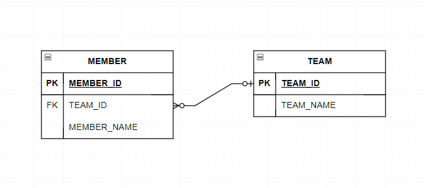
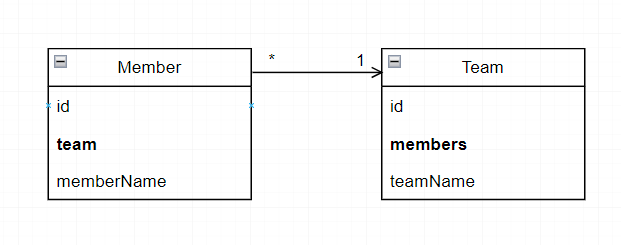

# Relationship
<br/>

### 이 글의 목적
```plaintext
- JPA의 Relationship Mapping (연관관계 매핑)에 대해 알아보고자 한다.
- 이번 글에서는 연관관계의 방향에 대해 알아볼 것이다.
```
<br/>

### 1. 연관관계 매핑
- DBMS와 JAVA에서 데이터를 묶는 방식의 차이점에 대해 알아보자.
#### 1) DBMS
```plaintext
1. 테이블 정규화 과정을 거쳐 한 쪽의 테이블에 외래키를 만든다.
2. 외래키 제약에 걸린 테이블들 중 한 쪽에 있는 외래키만을 통해 JOIN 연산자로 데이터를 가져올 수 있다.
```
#### 2) JAVA
```plaintext
1. 어떤 객체가 다른 객체를 참조하는 방식으로 구현한다.
2. 한 쪽에 다른 객체를 참조하는 필드가 있더라도, 역으로 참조할 수는 없다.
```
#### --> 이와 같은 차이점을 해결해주는 JPA의 매핑에 대해 알아보자.
<br/>

### 2. 단방향 연관관계 (Unidirectional Relationship)
- TEAM 테이블과 MEMBER 테이블이 있고 TEAM 테이블의 TEAM_ID를 가리키는 외래키 TEAM_ID가 MEMBER 테이블에 있다고 가정할 때의 간단한 연관관계 예시를 [그림 1-1]과 [그림 1-2]로 그려보았다.
#### 1) 테이블 연관관계
#### [그림 1-1] - 테이블 연관관계

- MEMBER 테이블에 있는 외래키 TEAM_ID를 통해 JOIN 연산자로 데이터를 가져올 수 있다.
- 해당 JOIN 연산자를 사용한 SQL문은 [코드 1]과 같다.
#### [코드 1]
```sql
SELECT *
    FROM MEMBER m
    LEFT JOIN TEAM t ON m.TEAM_ID = t.TEAM_ID;
```
#### [그림 1-2] - 객체 단방향 연관관계

- Member 클래스 내부에 Team 타입의 필드를 추가한다.
- 이 경우 Member에서 Team을 참조할 수는 있지만, 역방향으로의 참조는 불가하다.
#### [코드 2-1]
```java
@Entity
@Getter
@Setter
public class Team {

    @Id
    @GeneratedValue
    @Column(name = "team_id")
    private Long id;
    
    private String teamName;
}
```
#### [코드 2-2]
```java
@Entity
@Getter
@Setter
public class Member {

    @Id
    @GeneratedValue
    @Column(name = "member_id")
    private Long id;

    private String memberName;

    private Team team;
}
```
<br/>

### 3. 양방향 연관관계 (Bidirectional Relationship)
- Team 클래스에서 Member로 참조하고 싶은 경우, Member 객체를 담을 수 있는 List타입의 변수를 만들어주면 된다.
#### [그림 2] - 객체 양방향 연관관계

#### [코드 3]
```java
@Entity
@Getter
@Setter
public class Team {

    @Id
    @GeneratedValue
    @Column(name = "team_id")
    private Long id;

    private String teamName;

    private List<Member> members = new ArrayList<>();
}
```
