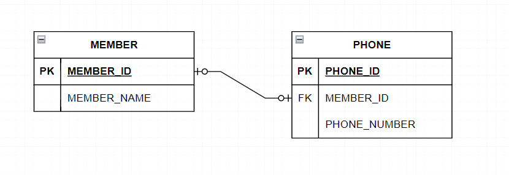
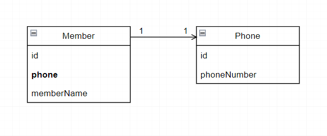
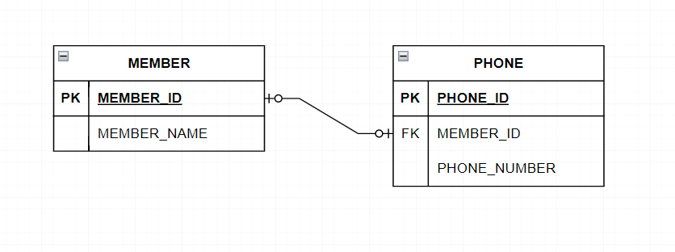
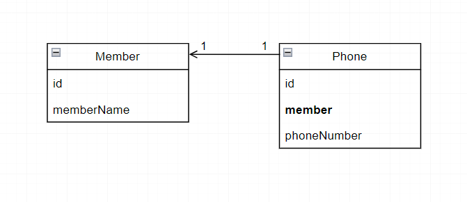
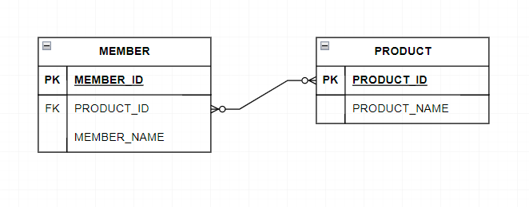
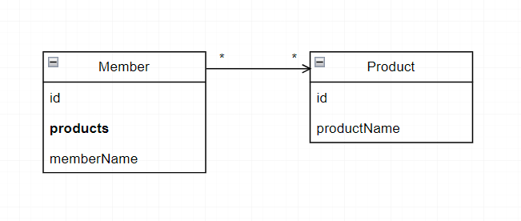

# Relationship
<br/>

### 이 글의 목적
```plaintext
- JPA의 Relationship Mapping (연관관계 매핑)에 대해 알아보고자 한다.
- 이번 글에서는 연관관계의 다중성에 대해 알아볼 것이다.
```
<br/>

### 연관관계의 다중성 (Multiplicity)
- 연관관계의 다중성은 총 4종류로 분류할 수 있다.
- 1:1, 1:N, N:1, N:M
<br/>

### 1. N:1 - @ManyToOne
- 가장 많이 사용되는 연관관계이다.
#### [그림 1]

#### [코드 1-1]
```java
@Entity
@Getter
@Setter
public class Member {

    @Id
    @GeneratedValue
    @Column(name = "member_id")
    private Long id;

    private String memberName;

    @ManyToOne(fetch = FetchType.LAZY)
    @JoinColumn(name = "team_id")
    private Team team;
}
```
#### [코드 1-2]
```java
@Entity
@Getter
@Setter
public class Team {

    @Id
    @GeneratedValue
    @Column(name = "team_id")
    private Long id;

    private String teamName;
}
```
<br/>

### 2. 1:N - @OneToMany
- N:1 연관관계과 반대되는 개념이다.
- 연관관계의 주인 쪽에 @JoinColumn으로 JOIN하고자 하는 외래키의 이름을 지정해주지 않으면 <br/> 두 테이블을 JOIN한 결과인TEAM_MEMBER라는 중간 테이블이 자동으로 생성되어 <br/> 운영의 어려움과 성능의 저하를 유발할 수 있으니 이 점에 유의해야 한다.
#### [그림 2]

#### [코드 2-1]
```java
@Entity
@Getter
@Setter
public class Member {

    @Id
    @GeneratedValue
    @Column(name = "member_id")
    private Long id;

    private String memberName;
}
```
#### [코드 2-2]
```java
@Entity
@Getter
@Setter
public class Team {

    @Id
    @GeneratedValue
    @Column(name = "team_id")
    private Long id;

    @OneToMany
    @JoinColumn(name = "team_id")
    private List<Member> members = new ArrayList<>();

    private String teamName;
}
```
<br/>

### 3. 1:1 - @OneToOne
- 모든 회원은 반드시 한 개의 휴대폰을 가지고 있다는 비즈니스 로직이 있다고 가정하자.
- 회원 테이블이 휴대폰 테이블에 대한 외래키를 가지고 있다고 가정할 때의 테이블 연관관계를 다이어그램으로 나타내면 [그림 3-1]과 같다.
#### [그림 3-1]

- 객체 연관관계를 다이어그램으로 나타내면 [그림 3-2]와 같다.
#### [그림 3-2]

#### [코드 3-1]
```java
@Entity
@Getter
@Setter
public class Member {

    @Id
    @GeneratedValue
    @Column(name = "member_id")
    private Long id;

    @OneToOne
    @JoinColumn(name = "phone_id")
    private Phone phone;

    private String memberName;
}
```
#### [코드 3-2]
```java
@Entity
@Getter
@Setter
public class Phone {

    @Id
    @GeneratedValue
    @Column(name = "phone_id")
    private Long id;

    private String phoneNumber;
}
```
- 1:1의 연관관계의 경우에는 외래키를 상대 테이블에 지정하는 것도 가능하다.
- 휴대폰 테이블이 회원 테이블 대한 외래키를 가지고 있다고 가정할 때의 테이블 연관관계를 다이어그램으로 나타내면 [그림 3-3]과 같다.
#### [그림 3-3]

- 객체 연관관계를 다이어그램으로 나타내면 [그림 3-4]와 같다.
#### [그림 3-4]

#### [코드 3-3]
```java
@Entity
@Getter
@Setter
public class Member {

    @Id
    @GeneratedValue
    @Column(name = "member_id")
    private Long id;

    private String memberName;
}
```
#### [코드 3-4]
```java
@Entity
@Getter
@Setter
public class Phone {

    @Id
    @GeneratedValue
    @Column(name = "phone_id")
    private Long id;

    @OneToOne
    @JoinColumn(name = "member_id")
    private Member member;

    private String phoneNumber;
}
```
<br/>

### 4. N:M - @ManyToMany
- N:M 매핑을 위한 @ManyToMany가 JPA 공식 스펙에는 존재하지만, 복잡한 SQL문을 생성하고 운영을 어렵게 하기 때문에 실무에서의 사용을 권하지 않는다고 한다.
- 따라서, 두 테이블을 JOIN하는 테이블을 만들어서 각각에 대하여 @OneToMany와 @ManyToOne을 사용하는 방식으로 매핑하는 것이 바람직할 것이다.
### 1) @ManyToMany를 그대로 사용하는 방식
- 회원 테이블이 상품 테이블에 대한 외래키를 가지고 있다고 가정할 때의 테이블 연관관계를 다이어그램으로 나타내면 [그림 4-1]과 같다.
#### [그림 4-1]

- 객체 연관관계를 다이어그램으로 나타내면 [그림 4-2]와 같다.
#### [그림 4-2]

#### [코드 4-1]
```java
@Entity
@Getter
@Setter
public class Member{

    @Id
    @GeneratedValue
    @Column(name = "member_id")
    private Long id;

    private String memberName;


    @ManyToMany
    @JoinTable(name = "member_product")
    private List<Product> products = new ArrayList<>();

    public Member() {

    }

}
```
#### [코드 4-2]
```java
@Entity
@Getter
@Setter
public class Product {

    @Id
    @GeneratedValue
    private Long id;

    private String name;

    public Product() {

    }

}
```
