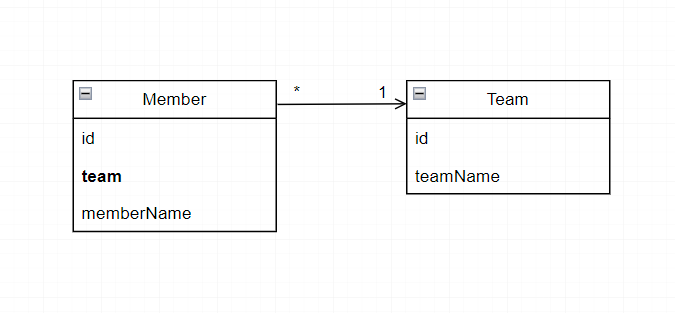
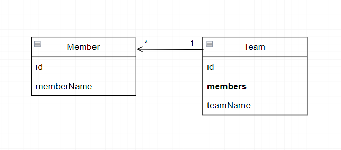

# Relationship
<br/>

### 이 글의 목적
```plaintext
- JPA의 Relationship Mapping (연관관계 매핑)에 대해 알아보고자 한다.
- 이번 글에서는 연관관계의 다중성에 대해 알아볼 것이다.
```
<br/>

### 1. 연관관계의 다중성 (Multiplicity)
- 연관관계의 다중성은 총 4종류로 분류할 수 있다.
- 1:1, 1:N, N:1, N:M
### 1) N:1 - @ManyToOne
- 가장 많이 사용되는 연관관계이다.
#### [그림 1]

#### [코드 1-1]
```java
@Entity
@Getter
@Setter
public class Member {

    @Id
    @GeneratedValue
    @Column(name = "member_id")
    private Long id;

    private String memberName;

    @ManyToOne(fetch = FetchType.LAZY)
    @JoinColumn(name = "team_id")
    private Team team;
}
```
#### [코드 1-2]
```java
@Entity
@Getter
@Setter
public class Team {

    @Id
    @GeneratedValue
    @Column(name = "team_id")
    private Long id;

    private String teamName;
}
```
### 2) 1:N - @OneToMany
- N:1 연관관계과 반대되는 개념이다.
- 연관관계의 주인 쪽에 @JoinColumn으로 JOIN하고자 하는 외래키의 이름을 지정해주지 않으면 <br/> 두 테이블을 JOIN한 결과인TEAM_MEMBER라는 중간 테이블이 자동으로 생성되어 <br/> 운영의 어려움과 성능의 저하를 유발할 수 있으니 이 점에 유의해야 한다.
#### [그림 2]

#### [코드 2-1]
```java
@Entity
@Getter
@Setter
public class Member {

    @Id
    @GeneratedValue
    @Column(name = "member_id")
    private Long id;

    private String memberName;
}
```
#### [코드 2-2]
```java
@Entity
@Getter
@Setter
public class Team {

    @Id
    @GeneratedValue
    @Column(name = "team_id")
    private Long id;

    @OneToMany
    @JoinColumn(name = "team_id")
    private List<Member> members = new ArrayList<>();

    private String teamName;
}
```
### 3) 1:1 - @OneToOne

### 4) N:M - @ManyToMany
