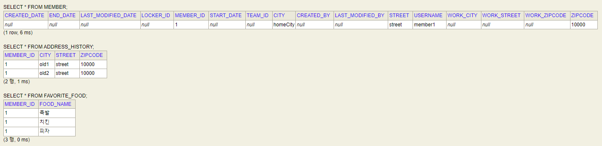

# Value Type
<br/>

### 이 글의 목적
    - 값 타입 컬렉션에 대해 알아보고자 한다.
<br/>

### 1. Value Type Collection
- 값 타입을 컬렉션 필드에 저장하는 것이다.
- @ElementCollection과 @CollectionTable을 사용해야 하며, 사용 예시는 [코드 1-1]에 있다.
#### [코드 1-1] - @Entity Member 클래스 내부
```java
@ElementCollection(fetch = FetchType.LAZY)
@CollectionTable(name = "favorite_food",
                 joinColumns = @JoinColumn(name = "member_id"))
@Column(name = "food_name")
private Set<String> favoriteFoods = new HashSet<>();

@ElementCollection(fetch = FetchType.LAZY)
@CollectionTable(name = "address_history",
                 joinColumns = @JoinColumn(name = "member_id"))
private List<Address> addressHistory = new ArrayList<>();
```
#### [코드 1-2] - 실행 클래스의 main() 메서드 내부
```java
Member member = new Member();
member.setUsername("member1");
member.setHomeAddress(new Address("homeCity", "street", "10000"));

member.getFavoriteFoods().add("치킨");
member.getFavoriteFoods().add("족발");
member.getFavoriteFoods().add("피자");

member.getAddressHistory().add(new Address("old1", "street", "10000"));
member.getAddressHistory().add(new Address("old2", "street", "10000"));

em.persist(member);
```
#### [코드 1-3] - H2 DBMS Query
```sql
SELECT * FROM MEMBER;
SELECT * FROM ADDRESS_HISTORY;
SELECT * FROM FAVORITE_FOOD;
```
#### [결과 1-1]
```plaintext
Hibernate: 
    /* insert for
        hellojpa.Member */insert 
    into
        member (created_by, created_date, city, street, zipcode, last_modified_by, last_modified_date, locker_id, team_id, username, work_city, work_street, work_zipcode, end_date, start_date, member_id) 
    values
        (?, ?, ?, ?, ?, ?, ?, ?, ?, ?, ?, ?, ?, ?, ?, ?)
Hibernate: 
    /* insert for
        hellojpa.Member.addressHistory */insert 
    into
        address (member_id, city, street, zipcode) 
    values
        (?, ?, ?, ?)
Hibernate: 
    /* insert for
        hellojpa.Member.addressHistory */insert 
    into
        address (member_id, city, street, zipcode) 
    values
        (?, ?, ?, ?)
Hibernate: 
    /* insert for
        hellojpa.Member.favoriteFoods */insert 
    into
        favorite_food (member_id, food_name) 
    values
        (?, ?)
Hibernate: 
    /* insert for
        hellojpa.Member.favoriteFoods */insert 
    into
        favorite_food (member_id, food_name) 
    values
        (?, ?)
Hibernate: 
    /* insert for
        hellojpa.Member.favoriteFoods */insert
    into
        favorite_food (member_id, food_name) 
    values
        (?, ?)
```
#### [결과 1-2]

#### --> [결과 1-1]에서 addressHistory나 favoriteFoods에 대하여 별도의 persist() 메서드를 사용하지 않았음에도 persist(member)만 해주면 member의 생명주기에 따라 연달아 insert문이 생성되었음을 확인할 수 있다.
#### --> [결과 1-2]에서 ADDRESS_HISTORY나 FAVORITE_FOOD 테이블에 매핑되는 별도의 @Entity 클래스를 만들지 않았음에도 해당 테이블이 조회되고 있음을 확인할 수 있다. 
<br/>

### 2. 지연 로딩 전략
- 값 타입 컬렉션의 생명주기는 Entity에 의존적이며, 기본적인 로딩 전략으로 지연 로딩이 사용된다.
- Member Entity를 조회하면 ADDRESS_HISTORY나 FAVORITE_FOOD 테이블에 대한 Select문이 실행되지 않음을 확인할 수 있다.
#### [코드 1]
```java
Member member = new Member();
member.setUsername("member1");
member.setHomeAddress(new Address("homeCity", "street", "10000"));

member.getFavoriteFoods().add("치킨");
member.getFavoriteFoods().add("족발");
member.getFavoriteFoods().add("피자");

member.getAddressHistory().add(new Address("old1", "street", "10000"));
member.getAddressHistory().add(new Address("old2", "street", "10000"));

em.persist(member);

em.flush();
em.clear();

Member findMember = em.find(Member.class, member.getId());
```
#### [결과 2]
```plaintext
Hibernate: 
    select
        (중략)
    from
        member m1_0 
    where
        m1_0.member_id=?
```
