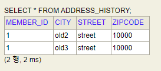

# Value Type
<br/>

### 이 글의 목적
    - JPA/Type/2024-02-13 03_value_type.md에서 다루었던 값 타입 컬렉션에 대해 내용을 보충하고자 한다.
<br/>

### 1. Value Type Modification
- 값 타입에 저장되어 있는 객체의 값을 수정할 경우, JAVA의 Reference Type 특성 상 해당 객체를 참조하는 다른 객체의 값이 원치 않게 변경되는 부작용이 발생할 수 있다.
- [코드 1]은 값 변경의 잘못된 예시이다.
#### [코드 1] - 실행 클래스의 main() 메서드 내부
```java
Member member = new Member();
member.setUsername("member1");
member.setHomeAddress(new Address("homeCity", "street", "10000"));

member.getFavoriteFoods().add("치킨");
member.getFavoriteFoods().add("족발");
member.getFavoriteFoods().add("피자");

member.getAddressHistory().add(new Address("old1", "street", "10000"));
member.getAddressHistory().add(new Address("old2", "street", "10000"));

em.persist(member);

em.flush();
em.clear();

Member findMember = em.find(Member.class, member.getId());

Address homeAddress = findMember.getHomeAddress();
findMember.getHomeAddress().setCity("newHomeCity");
```
#### --> [코드 1]처럼 작성할 경우, new Address("homeCity", "street", "10000")를 참조하는 다른 객체가 있다면 해당 객체의 city 값도 수정되니 유의해야 한다.
<br/>

### 2. Assign New Object
- 위와 같은 문제를 원천적으로 차단하기 위해 Address 클래스 내부에 있는 setter() 메서드를 없애거나 setter() 메서드의 접근 제한자를 public에서 private으로 바꿔야 한다.
- 객체의 필드값 전체를 Deep Copy하여 새로운 객체를 할당하는 식으로 값을 수정해야 한다.
#### [코드 2]
```java
// (중략)
Member findMember = em.find(Member.class, member.getId());

Address homeAddress = findMember.getHomeAddress();
Address copiedHomeAddress = new Address("newHomeCity", homeAddress.getStreet(), homeAddress.getZipcode());
findMember.setHomeAddress(copiedHomeAddress);
```
<br/>

### 3. Value Type Collection Modification
- 값 타입 컬렉션 내부의 객체의 값을 변경하기 위해서는 위와 같은 방식으로 객체 자체를 새로 할당해주어야만 한다.
- 지우고 싶은 객체를 remove() 메서드를 통해 지우고, 새로 저장하고 싶은 객체를 add() 메서드를 통해 추가하면 된다.
- 이런 방법을 사용하기 위해서는 @Embeddable 클래스 내부에 equals() 메서드와 hashcCode() 메서드를 자동으로 Override하여 생성해줘야 한다.
#### [코드 3-1]
```java
@Embeddable
@Getter
public class Address {

    private String city;
    private String street;
    private String zipcode;

    public Address() {

    }

    public Address(String city, String street, String zipcode) {
        this.city = city;
        this.street = street;
        this.zipcode = zipcode;
    }

    @Override
    public boolean equals(Object o) {
        if (this == o) return true;
        if (o == null || getClass() != o.getClass()) return false;
        Address address = (Address) o;
        return Objects.equals(getCity(), address.getCity()) && Objects.equals(getStreet(), address.getStreet()) && Objects.equals(getZipcode(), address.getZipcode());
    }

    @Override
    public int hashCode() {
        return Objects.hash(getCity(), getStreet(), getZipcode());
    }
}
```
#### [코드 3-2]
```java
Member findMember = em.find(Member.class, member.getId());

findMember.getAddressHistory().remove(new Address("old1", "street", "10000"));
findMember.getAddressHistory().add(new Address("old3", "street", "10000"));
```
#### [결과 3-1]

#### [결과 3-2]
```plaintext
Hibernate: 
    /* one-shot delete for hellojpa.Member.addressHistory */delete 
    from
        address_history 
    where
        member_id=?
Hibernate: 
    /* insert for
        hellojpa.Member.addressHistory */insert 
    into
        address_history (member_id, city, street, zipcode) 
    values
        (?, ?, ?, ?)
Hibernate: 
    /* insert for
        hellojpa.Member.addressHistory */insert 
    into
        address_history (member_id, city, street, zipcode) 
    values
        (?, ?, ?, ?)
```
#### --> [결과 3-1]을 통해 변경하고자 하는 내용이 DBMS에 잘 반영되었음을 확인할 수 있다.
#### --> 하지만, [결과 3-2]에서 알 수 있듯이, member의 ADDRESS_HISTORY 테이블을 전부 delete한 후 모든 데이터를 새로 insert하는 것을 확인할 수 있다.
