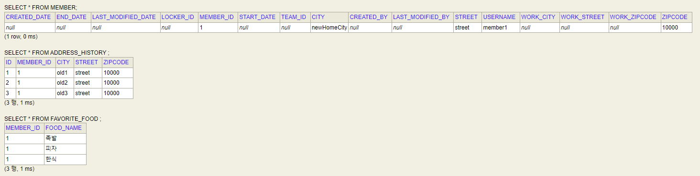

# Value Type
<br/>

### 이 글의 목적
    - JPA/Type/2024-02-13 04_value_type.md에서 다루었던 값 타입 컬렉션에 대해 내용을 보충하고자 한다.
<br/>

### 1. Constraints of Value Type Collection
- 값 타입에는 Entity와 달리 Primary Key와 같은 식별자의 개념이 없다.
- 값 타입 컬렉션에 변경 사항이 발생하면, 주인 Entity와 연관된 모든 데이터가 삭제되고, 값 타입 컬렉션에 있는 현재의 모든 값을 다시 저장한다.
- 따라서 실무에서는 상황에 따라 값 타입 컬렉션 대신 1:N 연관 관계 매핑을 사용하는 것을 고려하기도 한다.
#### [코드 1-1]
```java
import jakarta.persistence.Entity;
import jakarta.persistence.GeneratedValue;
import jakarta.persistence.Id;

@Entity(name = "address_history")
@Getter
@Setter
public class AddressEntity {

    @Id
    @GeneratedValue
    private Long id;

    private Address address;

    public AddressEntity() {

    }

    public AddressEntity(String city, String street, String zipcode) {
        this.address = new Address(city, street, zipcode);
    }
}
```
#### [코드 1-2]
```java
/*
@ElementCollection(fetch = FetchType.LAZY)
@CollectionTable(name = "address_history",
                 joinColumns = @JoinColumn(name = "member_id"))
private List<Address> addressHistory = new ArrayList<>();
*/

@OneToMany(cascade = CascadeType.ALL, orphanRemoval = true)
@JoinColumn(name = "member_id")
private List<AddressEntity> addressHistory = new ArrayList<>();

```
#### [코드 1-3] - 실행 클래스의 main() 메서드 내부
```java
Address homeAddress = findMember.getHomeAddress();
Address copiedHomeAddress = new Address("newHomeCity", homeAddress.getStreet(), homeAddress.getZipcode());
findMember.setHomeAddress(copiedHomeAddress);

findMember.getFavoriteFoods().remove("치킨");
findMember.getFavoriteFoods().add("한식");

findMember.getAddressHistory().remove(new AddressEntity("old1", "street", "10000"));
findMember.getAddressHistory().add(new AddressEntity("old3", "street", "10000"));
```
#### [결과 1-1]
```plaintext
Hibernate: 
    /* delete for hellojpa.Member.favoriteFoods */delete 
    from
        favorite_food 
    where
        member_id=? 
        and food_name=?
Hibernate: 
    /* insert for
        hellojpa.Member.favoriteFoods */insert 
    into
        favorite_food (member_id, food_name) 
    values
        (?, ?)
```
#### [결과 1-2]

#### --> [결과 1-1]에서 insert문이 한 번만 생성되었음을 확인할 수 있다.
#### --> [결과 1-2]에서 ADDRESS_HISTORY에 Primary Key인 "ID"가 부여되었음을 확인할 수 있다
