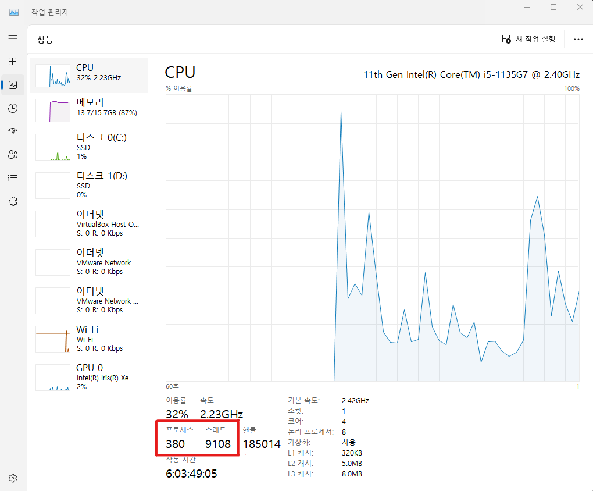

# Process
 

### 이 글의 목적
    - 프로세스가 고속으로 실행되기 위해서는 멀티 스레딩 (Multi Threading)이 필수적이다.
    - 프로세스와 스레드의 개념을 익히고 어떻게 프로그래밍해야 하는지 알아보고자 한다.
 

### 프로그램 (Program) vs 프로세스 (Process)
#### 프로그램과 프로세스의 차이에 대해 알고 있어야 한다.
#### 1. 프로그램
    - HDD에 저장된 실행 파일.

#### 2. 프로세스
    - HDD에 저장되어 있는 데이터를 Memory에 load시키고 CPU가 Memory에 접근하여 실행시키는 프로그램.
    - 실행 중이지 않은 프로그램은 프로세스가 아니다.
 

#### Windows OS 환경에서 작업 관리자 창을 열어 성능 탭에 들어가면 현재 실행 중인 프로세스와 스레드의 수를 확인할 수 있다.
#### [그림 1]

