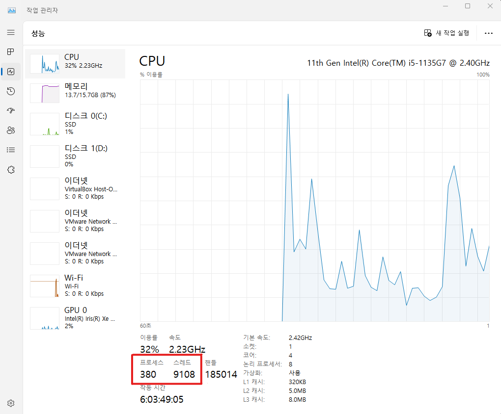

# Process
<br/>

### 이 글의 목적
    - 프로세스가 고속으로 실행되기 위해서는 멀티 스레딩 (Multi Threading)이 필수적이다.
    - 프로세스와 스레드의 개념을 익히고 어떻게 프로그래밍해야 하는지 알아보고자 한다.
<br/>

### 1. 프로그램 (Program) vs 프로세스 (Process)
- 프로그램과 프로세스의 차이에 대해 알고 있어야 한다.
#### 1) 프로그램
    - HDD에 저장된 실행 파일.

#### 2) 프로세스
    - 메모리와 CPU를 독립적으로 사용하는 독립적인 실행 단위.
    - HDD에 저장되어 있는 데이터를 Memory에 load시키고 CPU가 Memory에 접근하여 실행시키는 프로그램.
    - 실행 중이지 않은 프로그램은 프로세스가 아니다.
<br/>

### 2. 프로세스
#### 1) 프로세스의 사용 목적
- 시스템 자원을 효율적으로 사용하기 위해 사용한다.

#### 2) 프로세스의 상태
- 프로세스는 다음의 5가지 상태 중 하나의 상태를 갖고 있다.
```plaintext
1. 신규(New) 상태: 프로세스가 생성된 상태.
2. 준비(Ready) 상태: 프로세스가 CPU를 할당받을 준비가 된 상태.
3. 실행(Running) 상태: 프로세스가 CPU를 할당받아 실행 중인 상태.
4. 대기(Waiting) 상태: 프로세스가 CPU를 할당받지 못하고 대기 중인 상태.
5. 종료(Terminated) 상태: 프로세스가 종료된 상태.
```
<br/>

### 3. 스레드 (Thread)
- 스레드의 개념에 대해 알고 있어야 한다.
#### 1) 스레드
    - 프로세스 내에서 실행되는 독립적인 실행 단위.
    - 프로세스와 동일한 메모리를 공유한다.
<br/>

### 4. 멀티 프로그래밍 (Multi Programming) vs 멀티 스레딩 (Multi Threading)
- 멀티 프로세싱과 멀티 스레딩의 차이에 대해 알고 있어야 한다.
#### 1) 멀티 프로세싱
    - 동시에 여러 프로세스를 실행시키는 방법.
    - 멀티 프로그래밍이라고도 하지만, 엄밀히 말하면 멀티 프로세싱이라는 표현이 더 정확하다.
#### 2) 멀티 스레딩
    - 한 프로세스 내에서 여러 스레드를 실행시키는 방법.

#### Windows OS 환경에서 작업 관리자 창을 열어 성능 탭에 들어가면 현재 실행 중인 프로세스와 스레드의 수를 확인할 수 있다.
#### [그림 1]

