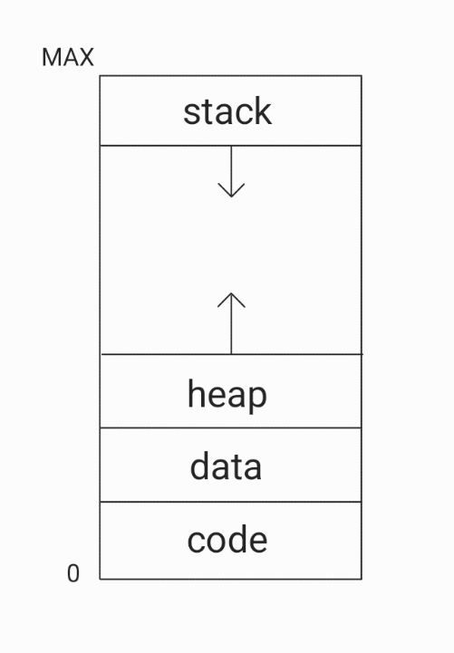

# Process, Thread
<br/>

### 이 글의 목적
    - 프로세스가 고속으로 실행되기 위해서는 멀티 스레딩 (Multi Threading)이 필수적이다.
    - 프로세스와 스레드의 개념에 대해 알아보고자 한다.
<br/>

### 1. 프로그램 (Program) vs 프로세스 (Process)
- 프로그램과 프로세스의 차이에 대해 알고 있어야 한다.
#### 1) 프로그램
    - 컴파일되어 저장장치 (HDD)에 저장된 실행 파일.
#### 2) 프로세스
    - 현재 실행 중인 프로그램.
    - 메모리와 CPU를 독립적으로 사용하는 독립적인 실행 단위.
    - HDD에서 Memory로 load되어 CPU가 실행시키는 프로그램.
    - 실행 중이지 않은 프로그램은 프로세스가 아니다.
<br/>

### 2. 프로세스
#### 1) 프로세스의 사용 목적
- 시스템 자원을 효율적으로 사용하기 위해 사용한다.
<br/>

#### 2) 프로세스의 구성
- 프로세스의 다음과 같은 구성 요소로 이루어져 있다.
#### [구성 요소]
```plaintext
1. 프로그램 code: 가장 많은 부분을 차지하는 요소로서, 컴파일된 프로그램의 code이다.
2. PC (Program Counter): 다음에 실행할 명령 (instruction)의 주소를 가지고 있다.
3. CPU Register 내용
4. Process Stack: 함수에 필요한 정보 - 매개변수 (parameter), 복귀 주소, 지역 변수
5. Heap: 프로세스 실행 중에 동적으로 할당되는 메모리
6. Data Section: 전역 변수
```
#### --> 2와 3은 CPU 입장에서 필요한 정보이다.
#### --> 4, 5, 6은 각각의 프로세스가 실행되는 데 필요한 데이터이다.

### 3. 메모리 영역
- 프로그램이 OS로부터 할당받은 메모리 공간 네 개의 영역으로 나뉜다.
#### [메모리 영역]
```plaintext
1) Stack 영역
2) Heap 영역
3) Data 영역
4) Code 영역
```
#### 1) Stack 영역
```plaintext
- 함수의 호출과 관련된 지역 변수 (Local Variable), 매개 변수 (Parameter)와 return 값 등이 저장되는 영역이다.
- Stack 영역의 크기는 컴파일 시에 결정된다.
- Stack 영역은 함수의 호출과 동시에 할당되며, 함수가 종료되면 소멸한다.
- push()를 통해 데이터가 저장되고, pop()을 통해 데이터를 인출할 수 있다.
- 데이터 액세스가 빠른 편이지만 스택의 크기를 초과하도록 지역 변수와 매개 변수를 삽입할 수 없다.
```
#### 2) Heap 영역
```plaintext
- 사용자에 의해 동적으로 할당되고 해제되는 영역이다.
- Heap 영역의 크기는 런 타임 시에 결정된다.
- 데이터 액세스가 느린 편이지만 메모리 크기에 제한이 없다.
- 대표적으로, C Language에서는 malloc()을 통해 할당하고, free() 또는 delete 연산자를 통해 해제할 수 있다.
- JAVA에서는 new 연산자를 통해 할당하고, Garbage Collector가 자동으로 해제해 준다.
```
#### 3) Data 영역
```plaintext
- 전역 변수 (Global Variable), 정적 변수 (Static Variable), 문자열 상수 (Literal Constant)가 저장되는 영역이다.
- 프로그램의 시작과 함께 할당되며, 프로그램이 종료되면 소멸한다.
```
#### 4) Code 영역
```plaintext
- 실행할 프로그램의 코드가 기계어로 컴파일되어 저장되는 영역이다.
- 프로그램의 시작부터 종료까지 계속 메모리에 남이있다.
```
#### --> Data 영역과 Code 영역은 크기가 정적이며, Heap 영역과 Stack 영역은 크기가 동적이다.
- 아래의 [그림 1]은 메모리의 구조를 나타낸다.
#### [그림 1]

<br/>
#### 오버플로우 (Overflow)
```plaintext
- [그림 1]에서 Stack 영역과 Heap 영역의 크기가 동적으로 변하는데,
  Stack 영역이 커질수록 Heap 영역은 필연적으로 줄어들 수밖에 없고
  반대로 Heap 영역이 커질수록 Stack 영역은 필연적으로 줄어들 수밖에 없음을 알 수 있다.
```

#### 3) 프로세스의 상태
- 프로세스는 다음과 같은 상태 중 하나의 상태를 갖고 있다.
#### [프로세스의 상태]
```plaintext
1. 신규 (New) 상태: 프로세스가 생성된 상태.
2. 준비 (Ready) 상태: 프로세스가 CPU를 할당받을 준비가 된 상태.
3. 실행 (Running) 상태: 프로세스가 CPU를 할당받아 실행 중인 상태.
4. 대기 (Waiting) 상태: 프로세스가 CPU를 할당받지 못하고 대기 중인 상태.
5. 종료 (Terminated) 상태: 프로세스가 종료된 상태.
```
<br/>

