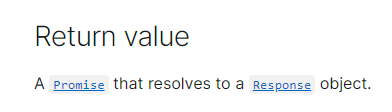

# fetch API (ES6)
<br/>

### 이 글의 목적
    - fetch API를 Promise 객체와 연관하여 개념을 익히고자 한다.
<br/>

### fetch API의 return 타입
- fetch API를 .then() 및 .catch()와 함께 사용할 때 어떤 타입의 객체가 return되는지 유의할 필요가 있다.
- https://developer.mozilla.org/en-US/docs/Web/API/fetch 에 아래의 [그림 1]과 같이 return 타입에 대해 기술되어 있다.
#### [그림 1]

#### --> [그림 1]에서는 Response 타입의 객체를 돌려주는 Promise가 return 된다고 설명되어 있다.
#### 보다 더 구체적인 예시 코드인 [코드 1]과 [코드 2]를 통해 이 말이 무슨 뜻인지 이해해보려고 한다.
<br/>

### 1. 정상 URL
- fetch()의 인자에 https://jsonplaceholder.typicode.com/posts 라는 정상 URL을 넣고 실행해 보았다.
#### [코드 1]
```javascript
fetch('https://jsonplaceholder.typicode.com/posts')
.then(response => console.log(`then 실행 / ${response}`))
.catch(error => console.log(`catch 실행 / ${error}`));
```
#### [결과 1]
    then 실행 / [object Response]
#### --> .then() 메서드가 실행되고, Response 객체를 resolve하는 것을 확인할 수 있다.
<br/>

### 2. 비정상 URL
- fetch()의 인자에 https://jsonplaceholders.typicode.com/posts 라는 비정상 URL을 넣고 실행해 보았다.
#### [코드 2]
```plaintext
fetch('https://jsonplaceholders.typicode.com/posts')
.then(response => console.log(`then 실행 / ${response}`))
.catch(error => console.log(`catch 실행 / ${error}`));
```
#### [결과 2]
    catch 실행 / TypeError: Failed to fetch
####
#### --> .catch() 메서드가 실행되고, error를 reject하는 것을 확인할 수 있다.
<br/>

### 중간 정리: fetch API와 Promise
#### [정리 1]
```plaintext
    1. fetch API의 return 타입은 Promise이다.
    2. Promise는 사용되는 즉시 pending 상태이다.
    3. 비동기 처리를 성공하면 .then()으로 전달된 함수를 호출하고, (resolved)
       비동기 처리를 실패하면 .catch()로 전달된 함수를 호출한다. (rejected)
    4. .then()과 .catch()를 거치면 다시 Promise가 return되는데, 이때 pending 상태이다.
```
#### --> [정리 1]에 따라 Promise를 사용하는 두 가지 방식이 있는데, 그 방식에 대해서는 별도의 파일을 만들어 설명할 예정이다.
